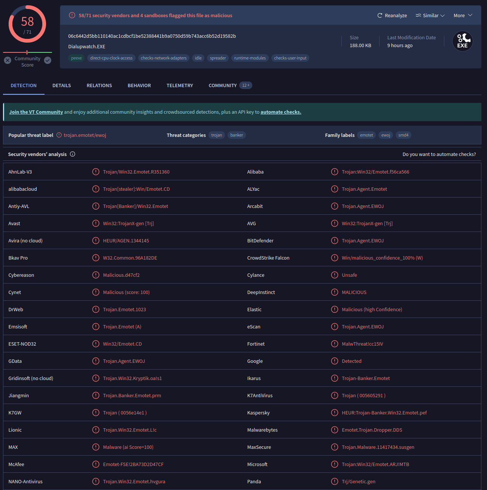
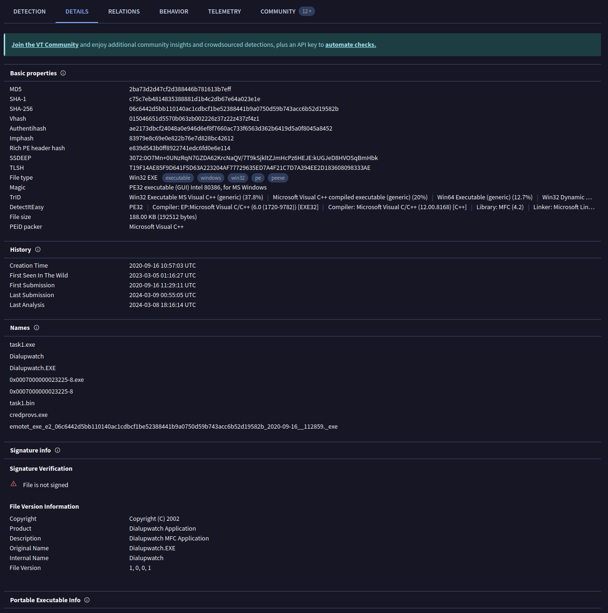
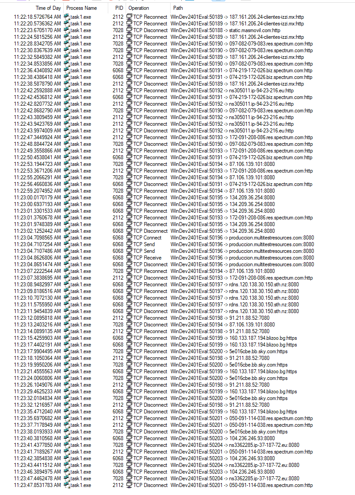
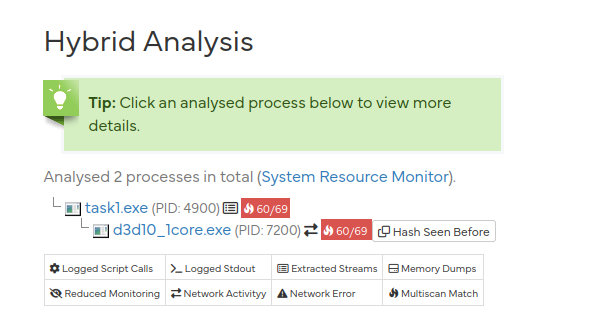
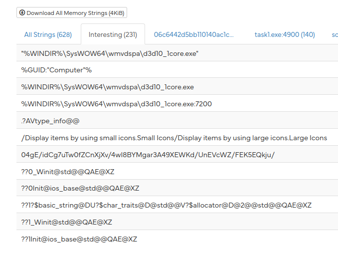
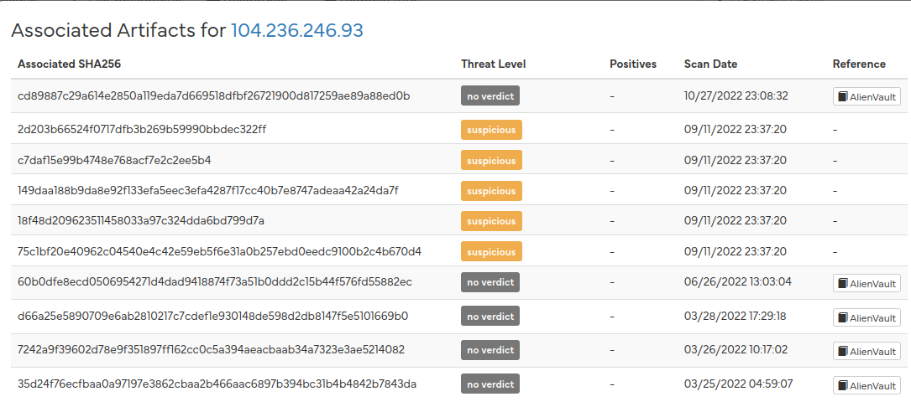
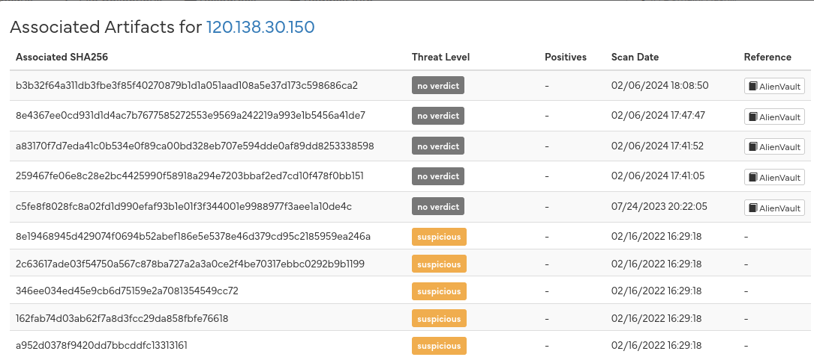
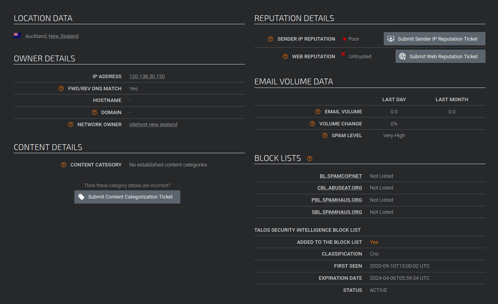

# MALWLAB Aufgabe 01: Dynamische Analyse

Analysereport von Aaron König, [aaron.koenig@stud.hslu.ch](aaron.koenig@stud.hslu.ch)

## 1. Zusammenfassung

Es handelt sich bei der analysierten Datei task1.exe um ein Sample des Ebanking-Trojaners Emotet, welches am 16.09.2022 kompiliert wurde. Da das erste Sample auf Virustotal am gleichen Tag hochgeladen wurde, ist davon auszugehen, dass der Virus sofort nach der Erstellung erste Computer infizierte. Gemäss Virustotal wurde das Sample das erste Mal am 05.03.2023 in the wild beobachtet.

### Verhalten

Wenn die Datei ausgeführt wird, kopiert sie sich selbst unter einem zufälligen Namen unter %WINDIR%\SysWOW64\ oder einen Unterordner. Der Trojaner wird verzögert aktiv und versucht sich danach auf eine Liste von C&C-Servern zu verbinden. Die Command und Control server scheinen teils 2020 in Betrieb genommen worden zu sein, ungefähr zu der Zeit, als die Malware kompiliert wurde. Während die meisten Adressen im Laufe der Zeit von Netz genommen worden zu sein scheinen, scheint zumindest eine der Adressen noch aktiv.

### Capabilities

Über die Fähigkeiten der Malware können keine definitive Aussagen gemacht werden, da die der Grossteil der Funktionalität der Software verpackt zu scheint, und eine tiefergehende Analyse der Malware ausserhalb des Scopes dieser Untersuchung war. Die aufgerufenen Windows API-Funktionen deuten auf folgende Fähigkeiten hin:

- Erstellen von Screenshots
- Keylogging
- Injection in andere Prozesse

Die weiteren Kapitel beschreiben das Vorgehen bei der Analyse im Detail:

## 2. Statische Analyse

### Umgebung

Archlinux KVM-VM unter Arch Linux

### 1: Bestimmen des Dateityps

```
file task1.exe
task1.exe: PE32 executable (GUI) Intel 80386, for MS Windows, 4 sections
```

**Es handelt sich um ein Windows-Executable.**

### 2. Information Gathering via Virustotal

Der Hashwert wurde berechnet und auf Virustotal gesucht:



**Diverse Antiviren-Hersteller schlagen auf Emotet an. Dem entsprechend kann davon ausgegangen werden, dass es sich um ein Emotet-Sample handelt.**

Danach wurden die Daten unter Details geprüft, um weitere Informationen zum Alter des Samples zu erhalten:



Das Sample ist gemäss das erste Mal am 05.03.2023 aufgetaucht. Da das Datum der First Submission (16.09.2020 11:29) wunderbar zur Creation Time passt (16.09.2020 10:57:03), ist sehr wahrscheinlich, dass die Malware gleich nach dem Build verbreitet wurde.


### 3. Sammeln Interessante Informationen über verwendete OS-Funktionalität

Um den Umfang abzuschätzen, wurden die Strings >= 10 Zeichen gezählt:

```bash
strings task1.exe | grep -a -e '[^\ ]\{10,\}' | wc -l
43
```

Die 43 Strings erscheinen im aktuellen Kontext eine Menge, welche ohne weitere Eingrenzung für eine Voranalyse verwendet werden kann. Im nächsten Schritt wurden Strings gesucht, die den Namen von DLL files enthalten:


```bash
strings task1.exe | grep .dll
ODBC32.dll
MSVCRT.dll
__dllonexit
KERNEL32.dll
USER32.dll
GDI32.dll
ADVAPI32.dll
SHELL32.dll
COMCTL32.dll
ole32.dll
MSVCP60.dll
MSIMG32.dll
.dll
odbccp32.dll
version.dll
```
13 DLL files werden erwähnt. Diese scheinen zur Windows OS-API zu gehören, weshalb sie im aktuellen Kontext nicht weiter betrachtet wurden. Stattdessen wurde versucht, die eingebundene Funktionalität durch Analye der API-Calls genauer zu verstehen. Zu diesem Zweck wurde aus den Quellen [Common API used in malware](https://book.hacktricks.xyz/reversing-and-exploiting/common-api-used-in-malware) und [Windows API Calls: The Malware Edition](https://sensei-infosec.netlify.app/forensics/windows/api-calls/2020/04/29/win-api-calls-1.html) Listen von API-Calls erstellt, die lose nach Angriffstechnik sortiert sind:

```
ls *.txt
interestingAPICalls_antiAnalysis.txt  interestingAPICalls_encryption.txt  interestingAPICalls_Files.txt  interestingAPICalls_networking.txt   interestingAPICalls_persistence.txt           interestingAPICalls_stealth.txt     interestingAPICalls_threadsProcesses.txt
interestingAPICalls_dllIjection.txt   interestingAPICalls_execution.txt   interestingAPICalls_misc.txt   interestingAPICalls_PEInjection.txt  interestingAPICalls_RegistryModification.txt  interestingAPICalls_systemInfo.txt

```

Diese Listen wurden mit den Strings im Sample abgeglichen:

```bash
strings task1.exe > ../task1Strings.txt 
while read line; do
grep -r $line
done < ../task1Strings.txt 2> /dev/null
interestingAPICalls_PEInjection.txt:SetThreadContext
interestingAPICalls_encryption.txt:CryptAcquireContext
interestingAPICalls_encryption.txt:CryptReleaseContext
interestingAPICalls_antiAnalysis.txt:GetVersion
interestingAPICalls_misc.txt:LockResource
interestingAPICalls_misc.txt:LoadResource
interestingAPICalls_dllIjection.txt:GetProcAddress
interestingAPICalls_misc.txt:GetProcAddress
interestingAPICalls_Files.txt:GetFileSize
interestingAPICalls_antiAnalysis.txt:CreateFileA
interestingAPICalls_misc.txt:EnableWindow
interestingAPICalls_systemInfo.txt:GetSystemMetrics
interestingAPICalls_misc.txt:BitBlt
interestingAPICalls_RegistryModification.txt:RegCloseKey
interestingAPICalls_dllIjection.txt:VirtualAllocEx
interestingAPICalls_dllIjection.txt:VirtualAllocEx
interestingAPICalls_PEInjection.txt:VirtualAllocEc
interestingAPICalls_stealth.txt:VirtualAlloc
interestingAPICalls_dllIjection.txt:VirtualAllocEx
interestingAPICalls_dllIjection.txt:VirtualAllocEx
interestingAPICalls_PEInjection.txt:VirtualAllocEc
interestingAPICalls_stealth.txt:VirtualAlloc
interestingAPICalls_stealth.txt:VirtualProtect
interestingAPICalls_stealth.txt:NtWriteVirtualMemory

```

Anhand der Matches konnten **mögliche** Funktionalitäten der Malware identifiziert werden:

| Capability | API Calls | Einschätzung |
|------------|--------------|-----------|
| Kryptographie | [CryptAcquireContext](https://learn.microsoft.com/en-us/windows/win32/api/wincrypt/nf-wincrypt-cryptacquirecontexta), [CryptReleaseContext](https://learn.microsoft.com/en-us/windows/win32/api/wincrypt/nf-wincrypt-cryptreleasecontext) | Aufgrund der Calls ist es wahrscheindlich, dass die Malware Kryptographie in irgend einer Weise benutzt. Es lässt sich aber keine Aussage darüber machen, warum und in welchem Kontext dies der Fall ist. |
| System Fingerprinting | [GetVersion](https://learn.microsoft.com/en-us/windows/win32/api/sysinfoapi/nf-sysinfoapi-getversion), [GetSystemMetrics](https://learn.microsoft.com/en-us/windows/win32/api/winuser/nf-winuser-getsystemmetrics),  [CreateFileA](https://learn.microsoft.com/en-us/windows/win32/api/fileapi/nf-fileapi-createfilea) | Die Software scheint mit GetVersion die OS-Version auszulesen. Zudem scheint GetSystemMetrics verwendet zu werden, um gewisse Systemparameter auszulesen. Dies könnte im Zusammenhang mit System Fingerprinting, beispielsweise für eine erste Triage oder für das Detektieren von Sandboxes verwendet werden. |
| Injection | [VirtualAllocExt](https://learn.microsoft.com/en-us/windows/win32/api/memoryapi/nf-memoryapi-virtualallocex), [GetProcAddress](https://learn.microsoft.com/en-us/windows/win32/api/libloaderapi/nf-libloaderapi-getprocaddress) | Die Malware scheint Prozesse zu lokalisieren, und Speicher in externen Prozess zu alloziieren. Dies könnte mit Process Hollowing oder DLL Injection in Zusammenhang stehen. VirtualAllocExt kommt verhältnismässig oft vor, was eine Hinweis auf eine intensive Verwendung geben könnte. |
| Stealth | [VirtualAlloc](https://learn.microsoft.com/en-us/windows/win32/api/memoryapi/nf-memoryapi-virtualalloc), [VirtualProtect](https://learn.microsoft.com/en-us/windows/win32/api/memoryapi/nf-memoryapi-virtualprotect), [NTWriteVirtualMemory](https://learn.microsoft.com/en-us/windows/win32/api/fileapi/nf-fileapi-writefile) | VirtualAlloc und VirtualProtect scheinen mit Packern in Verbindung zu stehen. Von dieser these ausgehend wurde im nächsten Schritt die Entropie der Datei geprüft. |
| Screenshots | [BitBlt](https://learn.microsoft.com/de-de/windows/win32/api/wingdi/nf-wingdi-bitblt) | Bitblt wird dafür benutzt, ein Bitmap aus einem Bildschirmausschnitt zu generieren. Daher steht der Call im Kontext von Malware oft im Zusammenhang mit Screenshots. Die Wahrscheinlichkeit, dass Screenshots gemacht werden wird als verhältnismässig hoch eingeschätzt, da es für Malware nicht viele andere Gründe zu geben scheint, diese Funktionalität zu nutzen. |
| Keylogging | [EnableWindow](https://learn.microsoft.com/en-us/windows/win32/api/winuser/nf-winuser-enablewindow) | EnableWindow aktiviert oder deaktiviert Tastatur- und Mauseingabe für ein Fenster. Da Malware (abgesehen von Ransomware) üblicherweise keine GUIs besitzt, scheint es wahrscheinlich, dass der API-Call mit Keylogging zusammenhängt |

### 3. Bestimmen der Entropie

Ein Script auf [der Webseite von cocomelonc](https://cocomelonc.github.io/malware/2022/11/05/malware-analysis-6.html) wurde benutzt, um die Entropie zu bestimmen:

```bash
echo 'import math

def shannon_entropy(data):
    # 256 different possible values
    possible = dict(((chr(x), 0) for x in range(0, 256)))

    for byte in data:
        possible[chr(byte)] +=1

    data_len = len(data)
    entropy = 0.0

    # compute
    for i in possible:
        if possible[i] == 0:
            continue

        p = float(possible[i] / data_len)
        entropy -= p * math.log(p, 2)
    return entropy' > my_entropy.py
python
```
```python
>>> from my_entropy import shannon_entropy
>>> mwFile = open("task1.exe", "rb")
>>> shannon_entropy(mwFile.read())
6.618160178953395
```

Gemäss [einer Vorlesung der University of Maryland, Baltimore County](https://redirect.cs.umbc.edu/courses/graduate/CMSC691am/student%20talks/CMSC%20691%20Malware%20-%20Entropy%20Analysis%20Presentation.pdf) ist die Entropie ausserhalb des 99,99% Confidence-Interfvals für verschlüsselte Executables, da die Entropie einer verschlüsselten Executable mit >= 7.14 deutlich höher sein müsste. Gleichzeitig ist sie aber ausserhalb des 99,99% Confidence Interwalls für ungepackte Executables, deren Entropie nicht grösser als 5.2 sein sollte. Dem entsprechnd kann davon ausgegangen werden, dass es sich um ein gepacktes Executable handelt. Da statische Analysen für gepackte Executables sehr aufwändig sind, wurde mit einer dynamischen Analyse weitergefahren.

## 3. Manuelle dynamische Analyse.

### Environment

Windows 11 Virtualbox VM auf Arch Linux

Folgende Software wurde installiert:

1. Sysinternals Process Monitor
2. Sysinternals Sysmon
3. Wireshark

### 1. Vorbereitung der Umgebung

1. Installation der Software
2. Deaktivierung des Antivirus inkl Exploit Protection
3. Deaktivieren der Firewall
4. Starten von Process Monitor und Wireshark
5. Löschen der Sysmon-Logs

### 2. Ausführung

Die Malware wurde 4-5 Mal ausgeführt, wobei die Logs jeweils für ca. 60 Sekunden laufen gelassen wurden. Da ei konnten leider keine irgendwelche beobachtbaren Annomalien festgestellt werden. Insbesondere wurden keine Dateien gedroppt und keine Netzwerkverbindungen geöffnet. Dank einem glückichen Zufall bin ich aber trotzdem zu einem Ergebnis gekommen. Die Analyse-VM wurde zur späteren Referenz pausiert, wobei die Malware-Prozesse aber nicht gestoppt worden sind. Als die Maschine danach wieder gestartet wurde, waren plötzlich diverse ausgehende Netzwerkverbindungen im Process Monitor zu beobachten:



### 3. Schlussfolgerungen

Da in den ersten Minuten keine auffälligen Aktionen beobachtet werden konnten, ist es sehr ahrscheinlich, dass die Malware erst verzögert aktiv wird. Dies könnte verwendet werden, um eine Analyse durch Sandboxes zu erschweren, da diese die Malware üblicherweise nur für einen egrenzten Zeitraum betrachten. Interessant an den kontaktierten Adressen ist, dass sich darunter anscheinend auch CC-Server befinden, die noch in Betrieb sind.  Dies lässt sich auch per NMAP erhärten:

```
Starting Nmap 7.94 ( https://nmap.org ) at 2024-03-09 20:44 CET
Nmap scan report for produccion.multitestresources.com (104.156.59.7)
Host is up (0.16s latency).

PORT     STATE SERVICE
8080/tcp open  http-proxy

Nmap done: 1 IP address (1 host up) scanned in 0.94 seconds
```

Zudem scheint es sich teils um Adressen zu handeln die Hybrid Analysis nicht bekannt sind.

## 4. Danymische Analyse mit Hybrid Analysis

Ein Upload der Datei brachte mich [auf eine bestehende Analyse eines Kommilitonen](https://www.hybrid-analysis.com/sample/06c6442d5bb110140ac1cdbcf1be52388441b9a0750d59b743acc6b52d19582b/64049fbf36b670f2ec04abad). Hier lässt sich aus den Strings und dem Process Tree entnehmen, dass die Datei **%WINDIR%\SysWOW64\wmvdspa\d3d10_1core.exe"** gedroppt wurde.

 <br />


Zudem wurden folgende IP-Adressen kontaktiert:

| Addresse | Port | Land|
|-------------|------|--------------------|
|74.219.172.26|TCP 80| Vereinigte Staaten |
|134.209.36.254|TCP 8080|Vereinigte Staaten |
|104.156.59.7|TCP 8080| Vereinigte Staaten |
|120.138.30.150|TCP 8080|Neuseeland|
|194.187.133.160|TCP 443|Bulgarien|
|104.236.246.93|TCP 8080|Vereinigte Staaten |
|74.208.45.104|TCP 8080|Vereinigte Staaten |

Auf Hybrid Analysis lässt sich feststellen, dass diese IP-Adressen in 2022 (vermutlich als die ersten entsprechenden Samples hochgeladen wurden) noch aktiv waren, wobei sie nicht im ganzen Jahr 2022 online gewesen zu sein scheinen:



Ob und wann die Adressen vom Netz genommen wurden, lässt sich nicht genau bestimmen, und ist nicht für alle CC-Server gleich. Es scheint aber, dass mindestens einer der Server im Juli 2023 nicht mehr online war:



Eine Prüfung der Adressen mit Thalos ergibt bei einigen Adressen ein First Seen-Datum um August/September 2020, was wiederum zum First Seen-Datum von Virustotal passt:



Es ist also wahrscheinlich, dass zumindest einige CC-Server mit dem Rollout dieser Malware um 2020 online genommen worden sind und den [Europol Emotet Takedown von 2021](https://www.europol.europa.eu/media-press/newsroom/news/world%E2%80%99s-most-dangerous-malware-emotet-disrupted-through-global-action) überlebt haben. Einige wurden dann in den Jahren darauf offline genommen. Heute scheint aber wie im letzten Kapitel erwähnt zumindest eine IP noch aktiv zu sein.

## 5. Analyse der gedroppten Datei

Für den Versuch, die gedroppte Datei zu Ananalysieren, wurde eine Datei mit entsprechendem Hash [bei Malwarebazaar heruntergeladen](https://bazaar.abuse.ch/browse.php?search=md5%3A2ba73d2d47cf2d388446b781613b7eff). Bei der Analyse wurde jedoch festgestellt, dass dass der Hash der gedroppten Datei identisch zum Hash des Droppers ist. Es handelt sich bei der zuvor analysierten Datei also nicht um einen dropper, der die eigentliche Malware installiert, sondern um den fertigen Trojaner, der sich selbst an eine andere Stelle kopiert und von dort ausführt.